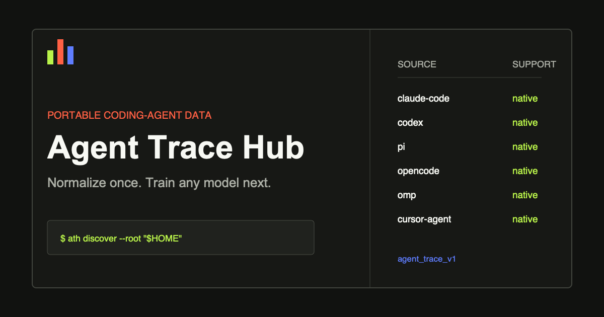

<h1 align="center">Agent Trace Hub</h1>

<p align="center">
  <strong>Collect coding-agent traces once. Train any model next.</strong><br />
  A local-first pipeline for discovering, normalizing, auditing, and rendering agent traces.
</p>

<p align="center">
  <a href="https://github.com/selimozten/agent-trace-hub/actions/workflows/ci.yml"></a>
  <a href="https://github.com/selimozten/agent-trace-hub/releases/latest"></a>
  <a href="https://selimozten.github.io/agent-trace-hub/"></a>
</p>

<p align="center">
  
</p>

Agent Trace Hub reads native local stores from Claude Code, Codex, Pi, Oh My
Pi, OpenCode, and Cursor Agent CLI, then writes one portable
`agent_trace_v1` JSONL contract. Keep canonical data stable and render it into
the exact format a future model or trainer expects.

Discovery, normalization, validation, deterministic auditing, rendering, and
dataset packaging run locally. There is no telemetry.

## Install

macOS or Linux:

```bash
curl -fsSL https://raw.githubusercontent.com/selimozten/agent-trace-hub/main/install.sh | sh
```

Windows PowerShell:

```powershell
irm https://raw.githubusercontent.com/selimozten/agent-trace-hub/main/install.ps1 | iex
```

The installers detect the platform, download the latest standalone executable,
and verify its SHA-256 checksum. The binary includes its runtime, dependencies,
SQLite driver, and JSON schemas; Node.js and Bun are not required.

Direct downloads and platform-specific instructions are available on the
[download site](https://selimozten.github.io/agent-trace-hub/) and the
[GitHub releases page](https://github.com/selimozten/agent-trace-hub/releases).

To install a specific release or directory:

```bash
curl -fsSL https://raw.githubusercontent.com/selimozten/agent-trace-hub/main/install.sh | \
  ATH_VERSION=0.1.0 ATH_INSTALL_DIR=/usr/local/bin sh
```

Build from source with Node.js 24 and Bun 1.3:

```bash
npm ci
npm run check
npm test
bun run install:local
```

## Supported Sources

| Source | Native store | Coverage |
| --- | --- | --- |
| Claude Code | `~/.claude/projects/**/*.jsonl` | branches, streamed assistant parts, subagents, tools |
| Codex | `~/.codex/sessions/**/*.jsonl` | reasoning, custom tools, web search, outputs |
| Pi | `~/.pi/agent/sessions/**/*.jsonl` | active branch replay, reasoning, tools |
| Oh My Pi | `~/.omp/agent/sessions/**/*.jsonl` | active branch replay, reasoning, tools |
| OpenCode | `~/.local/share/opencode/opencode.db` | read-only multi-session SQLite extraction |
| Cursor Agent CLI | `~/.cursor/projects/**/agent-transcripts/**/*.jsonl` | prompts, assistant text, tool requests |

Extended importers support Continue, Goose, Aider, OpenAI-compatible chat,
Anthropic Messages, generic nested JSON, and role-heading markdown. Run
`ath sources --json` for the executable registry and support tiers.

## First Dataset

```bash
ath discover --root "$HOME" --output raw/discovered-traces.jsonl

ath ingest \
  --manifest raw/discovered-traces.jsonl \
  --output canonical/shard-00001.agent_trace_v1.jsonl \
  --error-output canonical/ingest-errors.jsonl \
  --continue-on-error

ath audit \
  --input canonical/shard-00001.agent_trace_v1.jsonl \
  --output canonical/shard-00001.audit.json \
  --profile private

ath render \
  --format chatml \
  --input canonical/shard-00001.agent_trace_v1.jsonl \
  --output rendered/shard-00001.chatml.jsonl
```

Treat discovered manifests and trace shards as sensitive data. Inspect and
approve them under your own policy before training, sharing, or publishing.

## Usage

Normalize a trace:

```bash
agent-trace-hub sources

agent-trace-hub discover \
  --root "$HOME" \
  --output raw/discovered-traces.jsonl

agent-trace-hub normalize \
  --source auto \
  --input raw/session.jsonl \
  --output canonical/session.agent_trace_v1.jsonl
```

Normalize every supported file from a discovery manifest:

```bash
agent-trace-hub ingest \
  --manifest raw/discovered-traces.jsonl \
  --output canonical/shard-00001.agent_trace_v1.jsonl \
  --error-output canonical/ingest-errors.jsonl \
  --continue-on-error
```

V1 source values:

- `auto`
- `pi`
- `omp`
- `claude-code`
- `codex`
- `cursor-agent`
- `opencode`

Extended and compatibility importers remain available:

- `cursor` (legacy alias for `cursor-agent`)
- `continue`
- `goose`
- `openai-chat`
- `anthropic-messages`
- `generic-json`
- `aider`
- `markdown-transcript`

OpenCode needs no manual export. `discover` finds `~/.local/share/opencode/opencode.db`, and `ingest` reads all non-empty sessions in one read-only SQLite transaction. A single database manifest row can therefore produce many canonical traces.

The upstream JSON export remains supported for portable snapshots:

```bash
opencode export <session-id> > raw/opencode-session.json
```

The default `discover` scope is `--source v1`. Use `--source all` to include extended importers, or select one source explicitly.

| V1 harness | Native location under `--root` |
| --- | --- |
| Claude Code | `.claude/projects/**/*.jsonl` |
| Codex | `.codex/sessions/**/*.jsonl`, `.codex/rollouts/**/*.jsonl` |
| Pi | `.pi/agent/sessions/**/*.jsonl` |
| Oh My Pi | `.omp/agent/sessions/**/*.jsonl` |
| OpenCode | `.local/share/opencode/opencode.db` |
| Cursor Agent CLI | `.cursor/projects/**/agent-transcripts/**/*.jsonl` |

Cursor Agent transcripts preserve prompts, assistant text, and tool requests but do not currently contain tool results. Canonical Cursor traces make this explicit with `metadata.tool_results_available: false`.

Run `agent-trace-hub sources --json` to inspect the executable adapter registry. Each source is labeled `native`, `compatibility`, or `fallback`, and reports whether auto-detection is enabled.

`generic-json` is a conservative fallback for JSON/JSONL exports that are not provider-shaped but still contain role/content messages. It recognizes common nested arrays such as `messages`, `conversation`, `history`, `turns`, `events`, `transcript`, and `items`, plus role aliases like `human`, `ai`, `model`, and `tool_result`.

JSON and JSONL parsing is strict by default so corrupt rows cannot disappear silently. Active JSONL files are retried briefly when a writer is finishing a line, and persistent failures report the file and line number. `normalize`, `normalize-dir`, and `ingest` accept `--skip-invalid-lines` when partial recovery is intentional; the command still fails if no valid object records remain.

`discover` emits a JSONL manifest of candidate trace files and stores with `source`, `normalize_source`, `path`, `kind`, `confidence`, and `reason`. `kind` includes `sqlite` for multi-session stores.

`ingest` reads that manifest and uses each row's `normalize_source`, so one shard can combine all six v1 harnesses. Extended importers can be mixed into the same canonical shard when explicitly discovered.

Normalize a directory into one shard:

```bash
agent-trace-hub normalize-dir \
  --source auto \
  --input-dir raw/ \
  --output canonical/shard-00001.agent_trace_v1.jsonl
```

Validate canonical JSONL:

```bash
agent-trace-hub validate --input canonical/session.agent_trace_v1.jsonl
agent-trace-hub validate-artifact --kind audit --input canonical/shard-00001.audit.json
```

`validate-artifact` supports `agent-trace`, `audit`, `approval`, `discovery`, `ingest-error`, `release-manifest`, and `release-info`.

Audit a canonical shard before release:

```bash
agent-trace-hub audit \
  --input canonical/shard-00001.agent_trace_v1.jsonl \
  --output canonical/shard-00001.audit.json \
  --profile public \
  --secret secrets.txt \
  --deny private-company-name
```

The audit command validates the canonical shard, checks known literal secrets, deny regexes, common credential patterns, and preserved image blocks, then writes an `agent_trace_audit_v1` report. It exits non-zero by default when blocking findings exist. `--profile private` is the default; `--profile public` treats preserved image blocks as blocking release findings.

Create a human approval artifact:

```bash
agent-trace-hub approve \
  --audit-report canonical/shard-00001.audit.json \
  --output canonical/shard-00001.approval.json \
  --reviewer "@reviewer"
```

Approval requires a passing audit report and records reviewer, counts, audit input, and optional notes.

Create a dataset-level review gate:

```bash
agent-trace-hub review-gate \
  --input canonical/shard-00001.agent_trace_v1.jsonl \
  --output canonical/shard-00001.review-gate.json \
  --reviewer "@reviewer-or-llm" \
  --method manual \
  --summary "Reviewed for private training."
```

Use `--method llm` when the summary comes from an external LLM review workflow. Release accepts only approved review gates whose input matches the released shard.

Build a local canonical dataset directory:

```bash
agent-trace-hub release \
  --input canonical/shard-00001.agent_trace_v1.jsonl \
  --output-dir release/agent-traces \
  --audit-report canonical/shard-00001.audit.json \
  --approval-report canonical/shard-00001.approval.json \
  --review-gate canonical/shard-00001.review-gate.json \
  --name "my coding agent traces" \
  --license other
```

The release directory contains `data/*.agent_trace_v1.jsonl`, `manifest.jsonl`, `dataset_info.json`, `README.md`, and the canonical schema. It validates input structure and records file hashes/counts. Deterministic audit, human approval, and dataset-level review become release gates when supplied; gated releases currently require the report input to match the single released shard exactly. The `--license` value is dataset metadata for packaging systems such as Hugging Face; for private/internal training, `other` is acceptable until you choose a more specific policy.

Render for training:

```bash
agent-trace-hub render \
  --format openai-chat \
  --input canonical/session.agent_trace_v1.jsonl \
  --output rendered/session.openai-chat.jsonl

agent-trace-hub render \
  --format ornith-qwen-xml \
  --input canonical/session.agent_trace_v1.jsonl \
  --output rendered/session.ornith-qwen-xml.jsonl
```

Supported render values:

- `openai-chat`
- `anthropic-messages`
- `chatml`
- `sharegpt`
- `sft-text`
- `ornith-qwen-xml`

Enrich canonical traces with deterministic outcome signals:

```bash
agent-trace-hub enrich \
  --input canonical/session.agent_trace_v1.jsonl \
  --output canonical/session.enriched.agent_trace_v1.jsonl
```

`enrich` derives command, test, and build signals from assistant tool calls and tool outputs. It preserves existing canonical content and writes the signals under `outcome.signals`.

The existing Pi safety workflow remains available:

```bash
agent-trace-hub init --repo myuser/my-project-sessions
agent-trace-hub collect --secret secrets.txt --deny deny.txt README.md AGENTS.md
agent-trace-hub list --uploadable
agent-trace-hub upload --dry-run
```

## Canonical Format

Each output JSONL line is one complete session:

```json
{
  "schema": "agent_trace_v1",
  "session_id": "example",
  "source": {
    "agent": "pi",
    "model": "model-id",
    "cwd": "/redacted/project",
    "source_format": "pi-session-jsonl"
  },
  "metadata": {},
  "tools": [],
  "messages": [
    {
      "role": "user",
      "content": [{"type": "text", "text": "Fix the failing tests."}]
    },
    {
      "role": "assistant",
      "reasoning": [{"type": "text", "text": "I should inspect the test output."}],
      "content": [{"type": "text", "text": "I will run the tests."}],
      "tool_calls": [
        {"id": "call_1", "name": "bash", "arguments": {"command": "pytest"}}
      ]
    }
  ],
  "outcome": {"quality": "unlabeled"}
}
```

JSON Schema:

[schema/agent_trace_v1.schema.json](schema/agent_trace_v1.schema.json)

Additional artifact schemas live in `schema/` for discovery rows, ingest errors, audit reports, approval reports, review gate reports, release manifest entries, and release dataset info.

## Development

```bash
npm ci
npm run check
npm test
npm run build
```

`npm test` regenerates the examples and verifies:

- v1 Pi, OMP, Claude Code, Codex, Cursor Agent, and OpenCode normalization
- branch replay, Codex mirror deduplication, Cursor tool-input preservation, and direct OpenCode SQLite extraction
- extended OpenCode/Continue/Goose reasoning, context, tool-call, and tool-result preservation
- OpenCode/Continue/Goose compatibility import and native auto-detection
- adapter registry coverage, support labels, and compatibility auto-detection invariants
- active-writer retry, strict malformed JSON/JSONL rejection, and explicit partial JSONL recovery
- local trace discovery for supported harness directories
- mixed-source manifest ingest and error reporting
- canonical schema validation
- artifact schema validation for discovery, ingest errors, audit, approval, and release metadata
- user-facing `validate-artifact` coverage for every packaged schema
- malformed artifact rejection coverage for every `validate-artifact` kind
- deterministic canonical audit pass/fail behavior and release gating
- human approval artifact generation and release gating
- dataset-level review gate artifacts and release gating
- canonical release packaging, manifest counts, and overwrite protection
- all supported render formats
- deterministic outcome enrichment
- batch `normalize-dir`
- Codex response-item coalescing plus custom-tool preservation

## Data Ownership

Keep raw traces, canonical shards, audit reports, approvals, and rendered
training data private by default. This tool does not grant rights to source
code, prompts, model output, or other material contained in a trace. Dataset
licensing and consent remain the operator's responsibility.

## Community

- [Contributing guide](CONTRIBUTING.md)
- [Security policy](SECURITY.md)
- [Support](SUPPORT.md)
- [Roadmap](ROADMAP.md)
- [Changelog](CHANGELOG.md)

## Attribution And License Status

Agent Trace Hub began as an extension of
[badlogic/pi-share-hf](https://github.com/badlogic/pi-share-hf). See
[NOTICE.md](NOTICE.md) for attribution and current licensing status. The
upstream project does not declare a software license, so this repository does
not currently claim a blanket open-source license for inherited portions.
